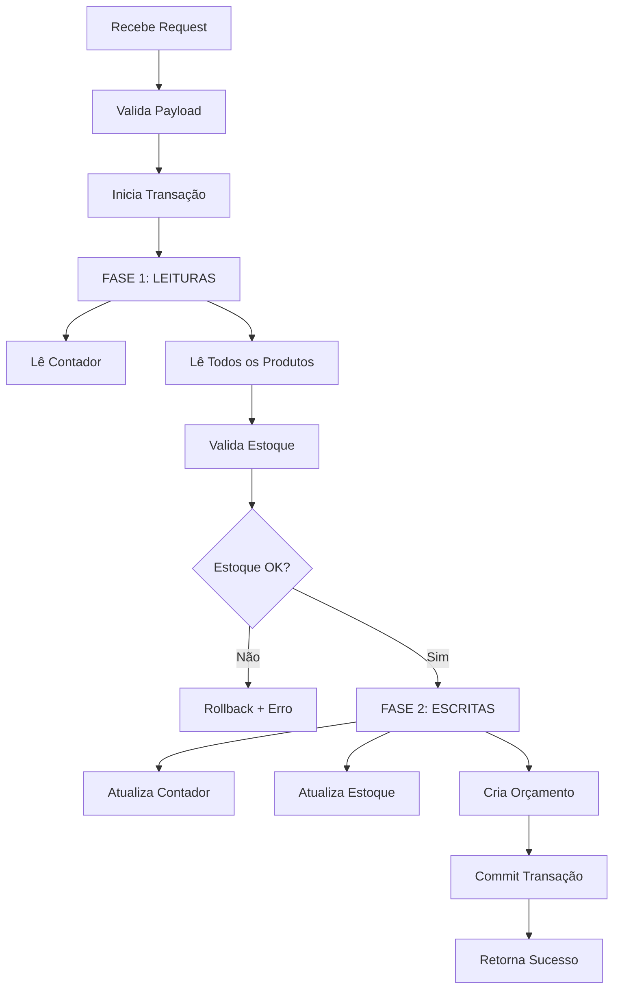

# 📚 APIs Next.js - Documentação Completa
## Sistema de Orçamentos, Produtos e Contato - Abratecnica

---

## 📋 Índice
1. [API de Produtos](#api-de-produtos)
2. [API de Orçamentos](#api-de-orçamentos)
3. [API de Contato](#api-de-contato)
4. [API de Inventário](#api-de-inventário)
5. [Integração com Frontend](#integração-com-frontend)
6. [Configuração Firebase](#configuração-firebase)
7. [Exemplos de Uso](#exemplos-de-uso)

---

## 📦 API de Produtos

### 📍 Endpoint
```
GET /api/products
OPTIONS /api/products
```

### 📝 Descrição
Retorna todos os produtos publicados do Firestore, expandindo variantes em produtos individuais.

### 🔧 Funcionalidades
- ✅ Busca apenas produtos com `published: true`
- ✅ Expande variantes em produtos separados
- ✅ Gera IDs únicos para cada variante: `{productId}-{variantSKU}`
- ✅ Combina nome do produto com valor da variante
- ✅ Usa preço específico da variante (ou preço base)
- ✅ Atribui estoque específico de cada variante
- ✅ Suporte CORS

### 📤 Response Success (200)
```json
[
  {
    "id": "PROD-001",
    "name": "Disco Flap 115mm",
    "code": "DF-115-60",
    "price": 15.90,
    "currentStock": 50,
    "published": true,
    "imageUrl": "https://...",
    "description": "...",
    // ... outros campos
  },
  {
    "id": "PROD-001-DF-115-80",
    "name": "Disco Flap 115mm - Grão 80",
    "code": "DF-115-80",
    "price": 16.50,
    "currentStock": 30,
    "published": true,
    // ... (variante expandida como produto separado)
  }
]
```

### 🔍 Estrutura de Produto com Variantes

**Produto Original no Firestore:**
```javascript
{
  id: "PROD-001",
  name: "Disco Flap 115mm",
  code: "DF-115",
  price: 15.90, // preço base
  variants: [
    {
      value: "Grão 60",
      sku: "DF-115-60",
      price: 15.90,
      stock: 50
    },
    {
      value: "Grão 80",
      sku: "DF-115-80",
      price: 16.50,
      stock: 30
    }
  ]
}
```

**Produtos Retornados pela API:**
```javascript
[
  {
    id: "PROD-001-DF-115-60",
    name: "Disco Flap 115mm - Grão 60",
    code: "DF-115-60",
    price: 15.90,
    currentStock: 50,
    variants: [] // limpo para variante individual
  },
  {
    id: "PROD-001-DF-115-80",
    name: "Disco Flap 115mm - Grão 80",
    code: "DF-115-80",
    price: 16.50,
    currentStock: 30,
    variants: []
  }
]
```

---

## 🛒 API de Orçamentos

### 📍 Endpoint
```
POST /api/orders
OPTIONS /api/orders
```

### 📝 Descrição
Cria um novo orçamento, valida estoque e atualiza inventário automaticamente usando transações Firestore.

### 🔧 Funcionalidades
- ✅ Validação de estoque em tempo real
- ✅ Atualização automática de inventário
- ✅ Geração de número sequencial de orçamento (ORC-00001)
- ✅ Transação atômica (tudo ou nada)
- ✅ Cálculo automático de totais
- ✅ Validade de 30 dias
- ✅ Suporte CORS

### 📥 Request Body
```json
{
  "clienteId": "string (obrigatório)",
  "vendedorNome": "string (opcional, default: 'Loja Online')",
  "itens": [
    {
      "produtoId": "string (obrigatório)",
      "quantidade": "number (obrigatório)",
      "valorUnitario": "number (obrigatório)"
    }
  ],
  "condicoesPagamento": "string (opcional)",
  "observacoes": "string (opcional)"
}
```

### 📤 Response Success (200)
```json
{
  "success": true,
  "orcamentoId": "string",
  "orcamentoNumero": "string (ex: ORC-00001)",
  "message": "Orçamento criado com sucesso e estoque atualizado."
}
```

### ❌ Response Error (400/500)
```json
{
  "success": false,
  "error": "string",
  "details": "string"
}
```

### 🔍 Validações
1. **Array de itens não vazio**
   - Erro: "A ordem deve conter itens"
   
2. **ClienteId obrigatório**
   - Erro: "Cliente ID é obrigatório"
   
3. **Produto existe**
   - Erro: "Produto com ID {id} não encontrado"
   
4. **Estoque suficiente**
   - Erro: "Estoque insuficiente para {produto}. Disponível: {x}, Solicitado: {y}"

### 📊 Estrutura no Firestore

**Collection: `vendasOrcamentos`**
```javascript
{
  orcamentoNumero: "ORC-00001",
  clienteId: "string",
  vendedorNome: "string",
  dataEmissao: Timestamp,
  dataValidade: Timestamp, // +30 dias
  itens: [
    {
      produtoId: "string",
      quantidade: number,
      valorUnitario: number,
      valorTotal: number
    }
  ],
  total: number,
  condicoesPagamento: "string",
  observacoes: "string",
  impostos: "Valores incluem impostos conforme legislação vigente (ICMS, IPI, PIS/COFINS).",
  status: "Pendente",
  origem: "Loja Online",
  createdAt: serverTimestamp()
}
```

**Collection: `counters`**
```javascript
{
  // Document ID: "vendasOrcamentos"
  value: number // Próximo número de orçamento
}
```

### 🔄 Fluxo de Transação



### 📝 Código da API

```typescript
"use server"

import { collection, doc, runTransaction, serverTimestamp } from "firebase/firestore";
import { db } from "@/lib/firebase";
import { NextResponse } from "next/server";

export async function POST(request: Request) {
  try {
    const payload = await request.json();
    
    if (!payload.itens || !Array.isArray(payload.itens) || payload.itens.length === 0) {
      return NextResponse.json(
        { 
          success: false,
          error: "A ordem deve conter itens" 
        }, 
        { status: 400 }
      );
    }

    if (!payload.clienteId) {
      return NextResponse.json(
        { 
          success: false,
          error: "Cliente ID é obrigatório" 
        }, 
        { status: 400 }
      );
    }

    let orderNumber: string;
    let orderId: string;

    await runTransaction(db, async (transaction) => {
      // --- FASE 1: LEITURAS ---
      
      // 1. Ler o contador de orçamentos
      const counterRef = doc(db, "counters", "vendasOrcamentos");
      const counterSnap = await transaction.get(counterRef);
      
      let nextNumber = 1;
      if (counterSnap.exists()) {
        nextNumber = counterSnap.data().value + 1;
      }
      orderNumber = `ORC-${nextNumber.toString().padStart(5, '0')}`;

      // 2. Ler todos os produtos para validar o estoque
      const productReads = payload.itens.map((item: any) => {
        const productRef = doc(db, "products", item.produtoId);
        return transaction.get(productRef);
      });
      const productSnaps = await Promise.all(productReads);
      
      let total = 0;
      const productUpdates: { ref: any, newStock: number }[] = [];

      for (let i = 0; i < productSnaps.length; i++) {
        const productSnap = productSnaps[i];
        const item = payload.itens[i];

        if (!productSnap.exists()) {
          throw new Error(`Produto com ID ${item.produtoId} não encontrado.`);
        }

        const productData = productSnap.data();
        if (productData.currentStock < item.quantidade) {
          throw new Error(`Estoque insuficiente para ${productData.name}. Disponível: ${productData.currentStock}, Solicitado: ${item.quantidade}`);
        }

        const newStock = productData.currentStock - item.quantidade;
        productUpdates.push({ ref: productSnap.ref, newStock });

        total += (item.valorUnitario || 0) * item.quantidade;
      }

      // --- FASE 2: ESCRITAS ---
      
      // 1. Atualizar o contador
      transaction.set(counterRef, { value: nextNumber }, { merge: true });

      // 2. Atualizar o estoque de cada produto
      productUpdates.forEach(({ ref, newStock }) => {
        transaction.update(ref, { currentStock: newStock });
      });
      
      // 3. Criar a nova ordem
      const orderRef = doc(collection(db, "vendasOrcamentos"));
      const newQuote = {
        orcamentoNumero: orderNumber,
        clienteId: payload.clienteId,
        vendedorNome: payload.vendedorNome || "Loja Online",
        dataEmissao: new Date(),
        dataValidade: new Date(new Date().setDate(new Date().getDate() + 30)),
        itens: payload.itens.map((item:any) => ({
          produtoId: item.produtoId,
          quantidade: item.quantidade,
          valorUnitario: item.valorUnitario,
          valorTotal: item.quantidade * item.valorUnitario
        })),
        total: total,
        condicoesPagamento: payload.condicoesPagamento || "",
        observacoes: payload.observacoes || "",
        impostos: "Valores incluem impostos conforme legislação vigente (ICMS, IPI, PIS/COFINS).",
        status: "Pendente",
        origem: "Loja Online",
        createdAt: serverTimestamp(),
      };
      transaction.set(orderRef, newQuote);
      orderId = orderRef.id;
    });

    return NextResponse.json({
      success: true,
      orcamentoId: orderId!,
      orcamentoNumero: orderNumber!,
      message: "Orçamento criado com sucesso e estoque atualizado."
    });

  } catch (error) {
    console.error("Error creating order:", error);
    const errorMessage = error instanceof Error ? error.message : "An unknown error occurred";
    return NextResponse.json(
      { 
        success: false,
        error: "Failed to create order", 
        details: errorMessage 
      }, 
      { status: 500 }
    );
  }
}

export async function OPTIONS(request: Request) {
  return new Response(null, {
    status: 200,
    headers: {
      'Access-Control-Allow-Origin': '*',
      'Access-Control-Allow-Methods': 'GET, OPTIONS, PATCH, DELETE, POST, PUT',
      'Access-Control-Allow-Headers': 'Content-Type, Authorization',
    },
  });
}
```

---

## 📧 API de Contato

### 📍 Endpoint
```
POST /api/contact
OPTIONS /api/contact
```

### 📝 Descrição
Processa formulários de contato e envia emails para múltiplos destinatários da Abratecnica.

### 🔧 Funcionalidades
- ✅ Múltiplos destinatários
- ✅ Validação de campos
- ✅ Logs de debug
- ✅ Suporte CORS
- ⚠️ Preparado para integração com serviço de email

### 📥 Request Body
```json
{
  "name": "string (obrigatório)",
  "email": "string (obrigatório)",
  "message": "string (obrigatório)"
}
```

### 📤 Response Success (200)
```json
{
  "success": true,
  "message": "Mensagem enviada com sucesso!"
}
```

### ❌ Response Error (500)
```json
{
  "success": false,
  "error": "Falha ao enviar mensagem",
  "details": "string"
}
```

### 📧 Destinatários Configurados
```javascript
const destinatarios = [
  'leandro.zuleiman@abratecnica.com.br',
  'claudio.roma@abratecnica.com.br'
];
```

### 🔌 Integração de Email (Preparada)

**Opções de Serviço:**
1. **Nodemailer** (SMTP)
2. **SendGrid** (Transactional)
3. **Resend** (Developer-friendly)
4. **AWS SES** (Enterprise)

**Template de Implementação:**
```javascript
// Exemplo com serviço de email
await emailService.send({
  from: 'claudio.roma@abratecnica.com.br',
  to: destinatarios,
  subject: `Novo contato de ${name}`,
  html: `
    <h2>Nova Mensagem de Contato</h2>
    <p><strong>Nome:</strong> ${name}</p>
    <p><strong>Email:</strong> ${email}</p>
    <p><strong>Mensagem:</strong></p>
    <p>${message}</p>
  `,
});
```

### 📝 Código da API

```typescript
"use server"

import { NextResponse } from "next/server";

export async function POST(request: Request) {
  try {
    const body = await request.json();
    const { name, email, message } = body;

    const destinatarios = [
      'leandro.zuleiman@abratecnica.com.br',
      'claudio.roma@abratecnica.com.br'
    ];

    // --- LÓGICA DE ENVÍO DE EMAIL AQUÍ ---
    // Integração com serviço de email (Nodemailer, SendGrid, Resend, etc.)
    
    console.log("Payload do formulário de contato:", body);
    console.log("Emails seriam enviados para:", destinatarios.join(', '));

    return NextResponse.json({
      success: true,
      message: "Mensagem enviada com sucesso!",
    });

  } catch (error) {
    console.error("Error processing contact form:", error);
    const errorMessage = error instanceof Error ? error.message : "Erro desconhecido";
    return NextResponse.json({ 
      success: false,
      error: "Falha ao enviar mensagem", 
      details: errorMessage 
    }, { status: 500 });
  }
}

export async function OPTIONS(request: Request) {
  return new Response(null, {
    status: 200,
    headers: {
      'Access-Control-Allow-Origin': '*',
      'Access-Control-Allow-Methods': 'POST, OPTIONS',
      'Access-Control-Allow-Headers': 'Content-Type, Authorization',
    },
  });
}
```

---

## 📦 API de Inventário

### 📍 Endpoint
```
GET /api/inventory/[productId]
```

### 📝 Descrição
Consulta o estoque atual de um produto específico em tempo real.

### 🔧 Funcionalidades
- ✅ Consulta rápida de estoque
- ✅ Validação de produto existente
- ✅ Response minimalista

### 📥 Request
```
GET /api/inventory/produto-123
```

### 📤 Response Success (200)
```json
{
  "productId": "produto-123",
  "stock": 150
}
```

### ❌ Response Error

**400 - Bad Request:**
```json
{
  "error": "Product ID is required"
}
```

**404 - Not Found:**
```json
{
  "error": "Product not found"
}
```

**500 - Server Error:**
```json
{
  "error": "Failed to fetch inventory",
  "details": "string"
}
```

### 📝 Código da API

```typescript
"use server"

import { doc, getDoc } from "firebase/firestore";
import { db } from "@/lib/firebase";
import { NextResponse } from "next/server";

export async function GET(
  request: Request,
  { params }: { params: { productId: string } }
) {
  try {
    const productId = params.productId;
    if (!productId) {
      return NextResponse.json({ error: "Product ID is required" }, { status: 400 });
    }

    const docRef = doc(db, "products", productId);
    const docSnap = await getDoc(docRef);

    if (!docSnap.exists()) {
      return NextResponse.json({ error: "Product not found" }, { status: 404 });
    }

    const productData = docSnap.data();
    const stock = productData.currentStock || 0;

    return NextResponse.json({ productId, stock });

  } catch (error) {
    console.error("Error fetching inventory:", error);
    const errorMessage = error instanceof Error ? error.message : "An unknown error occurred";
    return NextResponse.json({ error: "Failed to fetch inventory", details: errorMessage }, { status: 500 });
  }
}
```

---

## 🔗 Integração com Frontend

### 📋 Exemplo: Criar Orçamento

```javascript
async function criarOrcamento(carrinho, cliente) {
  try {
    const response = await fetch('https://seu-dominio.vercel.app/api/orders', {
      method: 'POST',
      headers: {
        'Content-Type': 'application/json',
      },
      body: JSON.stringify({
        clienteId: cliente.id,
        vendedorNome: 'Loja Online',
        itens: carrinho.map(item => ({
          produtoId: item.id,
          quantidade: item.quantity,
          valorUnitario: item.price
        })),
        condicoesPagamento: '30 dias',
        observacoes: cliente.observacoes || ''
      })
    });

    const data = await response.json();
    
    if (data.success) {
      console.log('Orçamento criado:', data.orcamentoNumero);
      alert(`Orçamento ${data.orcamentoNumero} criado com sucesso!`);
    } else {
      console.error('Erro:', data.error);
      alert(`Erro: ${data.details}`);
    }
  } catch (error) {
    console.error('Erro na requisição:', error);
    alert('Erro ao criar orçamento');
  }
}
```

### 📧 Exemplo: Enviar Contato

```javascript
async function enviarContato(formulario) {
  try {
    const response = await fetch('https://seu-dominio.vercel.app/api/contact', {
      method: 'POST',
      headers: {
        'Content-Type': 'application/json',
      },
      body: JSON.stringify({
        name: formulario.name,
        email: formulario.email,
        message: formulario.message
      })
    });

    const data = await response.json();
    
    if (data.success) {
      alert('Mensagem enviada com sucesso!');
      formulario.reset();
    } else {
      alert(`Erro: ${data.error}`);
    }
  } catch (error) {
    console.error('Erro:', error);
    alert('Erro ao enviar mensagem');
  }
}
```

### 📦 Exemplo: Consultar Estoque

```javascript
async function consultarEstoque(produtoId) {
  try {
    const response = await fetch(
      `https://seu-dominio.vercel.app/api/inventory/${produtoId}`
    );

    const data = await response.json();
    
    if (response.ok) {
      console.log(`Estoque de ${produtoId}: ${data.stock} unidades`);
      return data.stock;
    } else {
      console.error('Erro:', data.error);
      return 0;
    }
  } catch (error) {
    console.error('Erro:', error);
    return 0;
  }
}
```

---

## ⚙️ Configuração Firebase

### 📁 Estrutura de Arquivos Next.js

```
app/
├── api/
│   ├── orders/
│   │   └── route.ts          # API de Orçamentos
│   ├── contact/
│   │   └── route.ts          # API de Contato
│   └── inventory/
│       └── [productId]/
│           └── route.ts      # API de Inventário
└── lib/
    └── firebase.ts           # Configuração Firebase
```

### 🔧 Arquivo `lib/firebase.ts`

```typescript
import { initializeApp, getApps } from 'firebase/app';
import { getFirestore } from 'firebase/firestore';

const firebaseConfig = {
  apiKey: process.env.NEXT_PUBLIC_FIREBASE_API_KEY,
  authDomain: process.env.NEXT_PUBLIC_FIREBASE_AUTH_DOMAIN,
  projectId: process.env.NEXT_PUBLIC_FIREBASE_PROJECT_ID,
  storageBucket: process.env.NEXT_PUBLIC_FIREBASE_STORAGE_BUCKET,
  messagingSenderId: process.env.NEXT_PUBLIC_FIREBASE_MESSAGING_SENDER_ID,
  appId: process.env.NEXT_PUBLIC_FIREBASE_APP_ID
};

// Inicializa apenas se não houver app
const app = getApps().length === 0 ? initializeApp(firebaseConfig) : getApps()[0];
const db = getFirestore(app);

export { db };
```

### 🔐 Variáveis de Ambiente (`.env.local`)

```env
NEXT_PUBLIC_FIREBASE_API_KEY=sua-api-key
NEXT_PUBLIC_FIREBASE_AUTH_DOMAIN=seu-project.firebaseapp.com
NEXT_PUBLIC_FIREBASE_PROJECT_ID=seu-project-id
NEXT_PUBLIC_FIREBASE_STORAGE_BUCKET=seu-project.appspot.com
NEXT_PUBLIC_FIREBASE_MESSAGING_SENDER_ID=123456789
NEXT_PUBLIC_FIREBASE_APP_ID=1:123456789:web:abc123
```

---

## 🚀 Deploy na Vercel

### 📋 Passos

1. **Push para GitHub**
```bash
git add .
git commit -m "Add Next.js APIs"
git push origin main
```

2. **Conectar na Vercel**
   - Acesse [vercel.com](https://vercel.com)
   - Import repository
   - Configure environment variables

3. **Adicionar Variáveis de Ambiente**
   - Settings → Environment Variables
   - Adicionar todas as variáveis do `.env.local`

4. **Deploy Automático**
   - Cada push faz deploy automático
   - URL: `https://seu-projeto.vercel.app`

---

## 📊 Monitoramento

### 🔍 Logs na Vercel

```
Dashboard → Seu Projeto → Functions → Logs
```

### 📈 Métricas Importantes

- **Invocations:** Número de chamadas
- **Duration:** Tempo de execução
- **Errors:** Taxa de erro
- **Cold Starts:** Inicializações frias

---

## 🎯 Casos de Uso

### 1. E-commerce Completo
```javascript
// Fluxo: Adicionar ao carrinho → Checkout → Criar orçamento
carrinho.forEach(item => {
  // Verificar estoque antes
  const stock = await consultarEstoque(item.id);
  if (stock < item.quantity) {
    alert('Estoque insuficiente');
  }
});

// Criar orçamento
await criarOrcamento(carrinho, cliente);
```

### 2. Formulário de Contato
```javascript
// Página de contato com validação
form.addEventListener('submit', async (e) => {
  e.preventDefault();
  await enviarContato({
    name: form.name.value,
    email: form.email.value,
    message: form.message.value
  });
});
```

### 3. Dashboard de Produtos
```javascript
// Atualizar estoque em tempo real
produtos.forEach(async (produto) => {
  const estoque = await consultarEstoque(produto.id);
  produto.stock = estoque;
  renderProduto(produto);
});
```

---

## ✅ Checklist de Implementação

### Backend (Next.js)
- [ ] Criar estrutura de pastas `/app/api`
- [ ] Configurar Firebase (`lib/firebase.ts`)
- [ ] Implementar API de Orçamentos (`api/orders/route.ts`)
- [ ] Implementar API de Contato (`api/contact/route.ts`)
- [ ] Implementar API de Inventário (`api/inventory/[productId]/route.ts`)
- [ ] Configurar variáveis de ambiente
- [ ] Testar localmente (`npm run dev`)
- [ ] Deploy na Vercel

### Frontend (Abratecnica)
- [ ] Atualizar URLs das APIs no `config.js`
- [ ] Integrar formulário de contato
- [ ] Integrar checkout com API de orçamentos
- [ ] Adicionar validação de estoque
- [ ] Testar fluxo completo

### Firestore
- [ ] Criar collection `vendasOrcamentos`
- [ ] Criar collection `counters`
- [ ] Configurar regras de segurança
- [ ] Criar índices necessários

---

## 🛡️ Segurança

### Regras Firestore Recomendadas

```javascript
rules_version = '2';
service cloud.firestore {
  match /databases/{database}/documents {
    
    // Orçamentos: leitura pública, escrita apenas por backend
    match /vendasOrcamentos/{orderId} {
      allow read: if true;
      allow write: if false; // Apenas via backend
    }
    
    // Produtos: leitura pública, escrita restrita
    match /products/{productId} {
      allow read: if true;
      allow write: if request.auth != null;
    }
    
    // Counters: acesso apenas via backend
    match /counters/{counterId} {
      allow read, write: if false;
    }
  }
}
```

---

## 📞 Suporte

**Documentação criada para:** Abratecnica  
**Data:** Outubro 2025  
**Contatos:**
- leandro.zuleiman@abratecnica.com.br
- claudio.roma@abratecnica.com.br

---

**🎉 APIs prontas para produção com Next.js e Firebase!**
